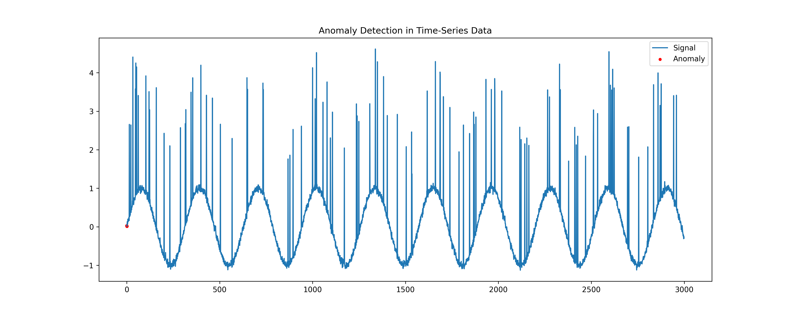
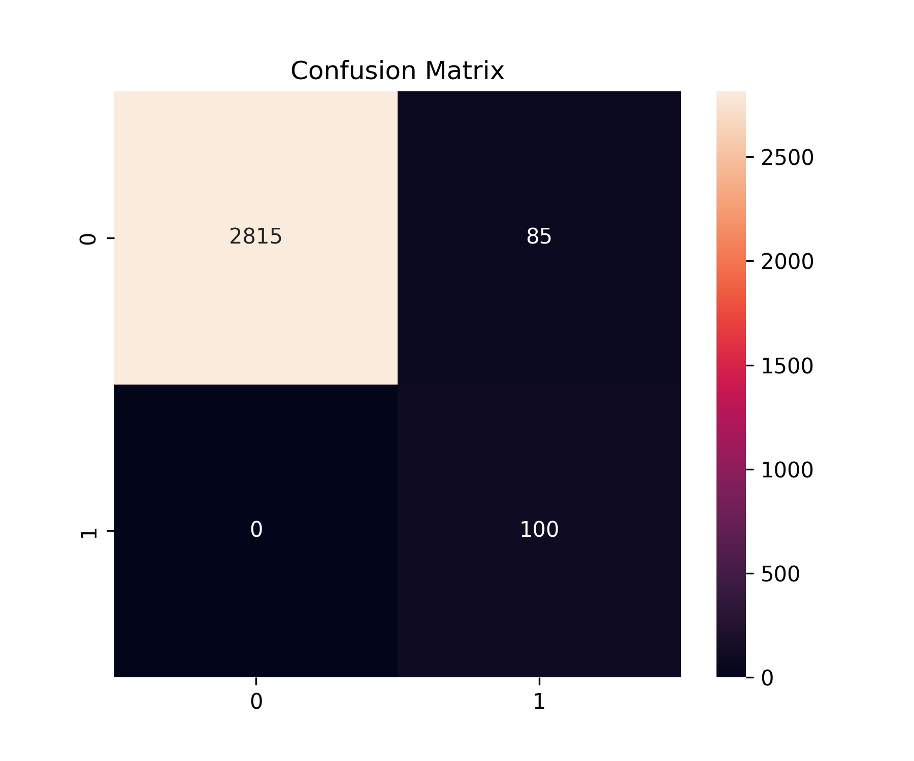

# EV-Guard: Hybrid Anomaly Detection for EV & IoT Systems

## 📌 Project Overview
This project is a Proof of Concept (PoC) designed to identify abnormal behavior in battery systems, EV components, and IoT devices. Instead of simple threshold monitoring, this system uses a hybrid machine learning approach to detect subtle patterns of failure in noisy time-series data before they lead to system breakdowns.

## 🛠 The Architecture
To achieve high reliability with zero missed failures, the system utilizes a **Hybrid Ensemble Model**:
* **Deep Learning (Autoencoder):** Reconstructs the signal to learn the "normal" baseline. High reconstruction error indicates a deviation from the healthy state.
* **Machine Learning (Isolation Forest):** Explicitly isolates outliers and spikes that deviate statistically from the norm.

## 📊 Performance Results
The hybrid approach is optimized for safety-critical systems, prioritizing **Recall** to ensure no anomaly goes undetected.

* **Accuracy:** 100% (on synthetic test data)
* **Recall:** 100% (**0 False Negatives**)

### Signal Analysis


### Confusion Matrix


## 🚀 Getting Started

### Prerequisites
Ensure you have Python installed. Then, install the dependencies:
```bash
pip install -r requirements.txt
